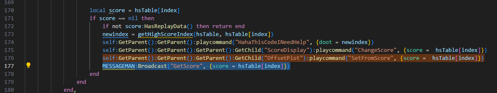
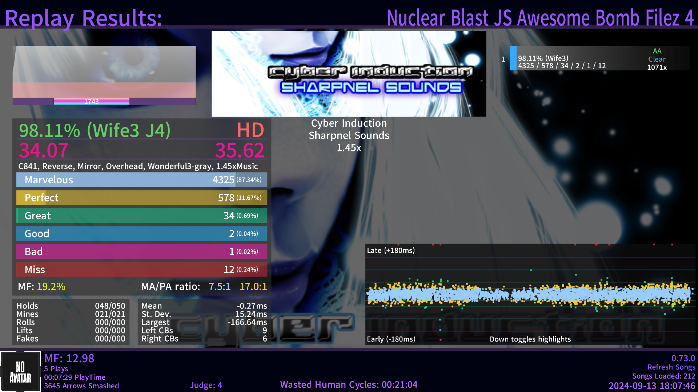
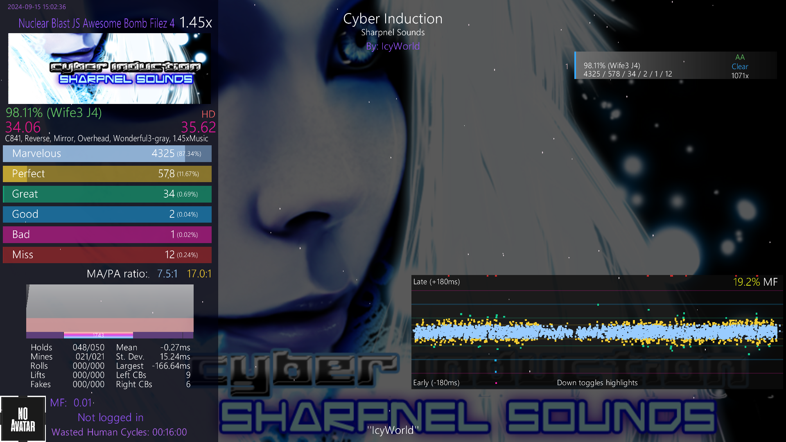
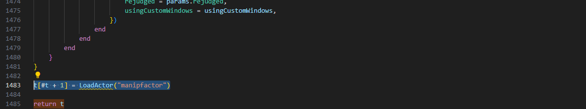
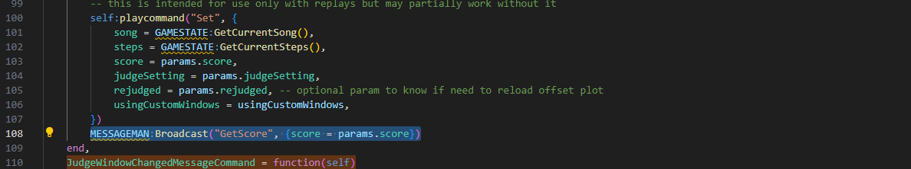
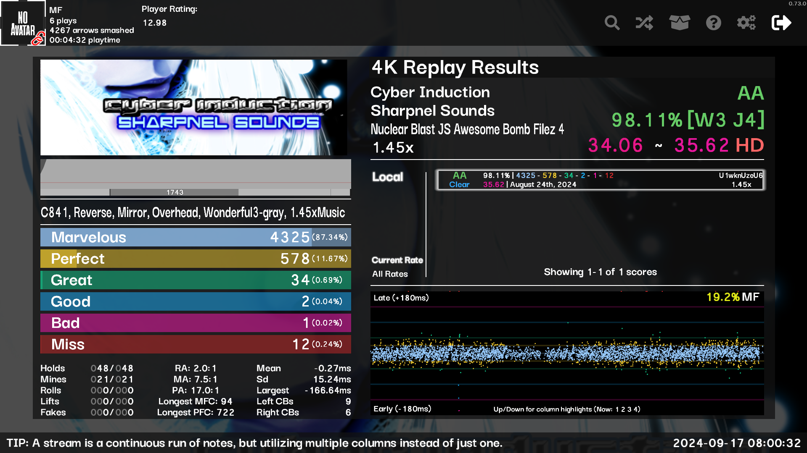
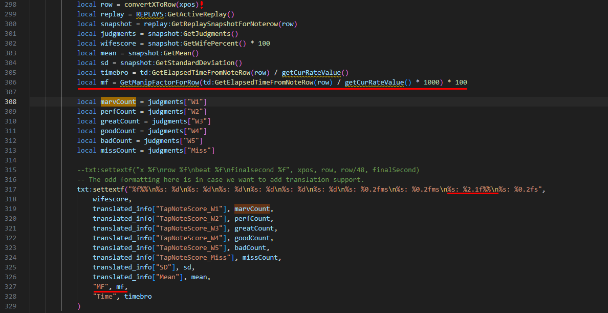
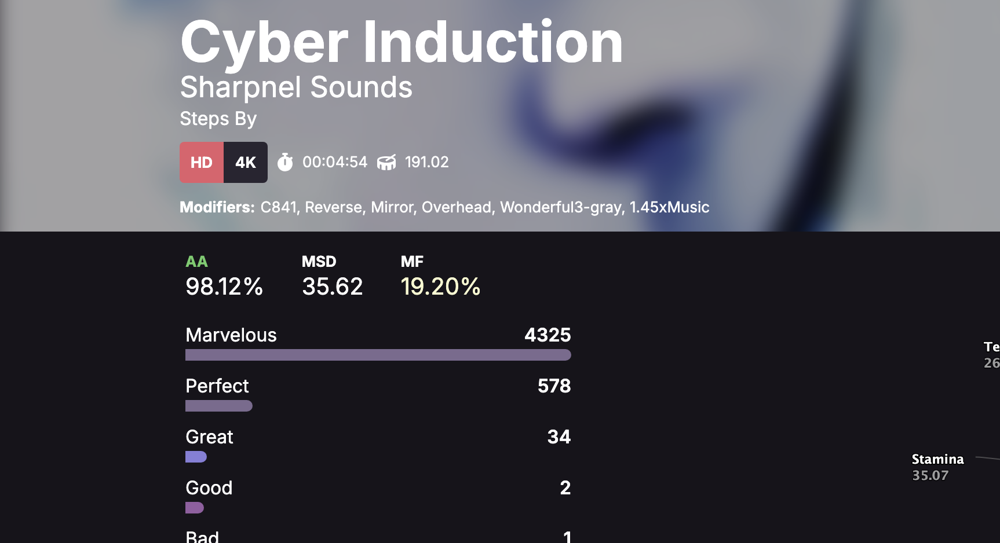

# ManipFactor Etterna
An Etterna addon that estimates the amount of manip based on replay data, introducing a new metric for play accuracy. Offers both an In-Game version and a browser-based version for EtternaOnline. Hover the cursor to see left and right hands separately.

Follow the instructions below for installation:

## In-Game Installation:
⚠️ **Caution: Before editing any files, make sure to create a backup of them. Don't leave the backup files in the same directory.**
### Til Death and Reimuboobs-theme:
1. Move `manipfactor.lua` to the following directory inside your Etterna game folder:
> Themes\Til Death\BGAnimations\ScreenEvaluation decorations

or

> Themes\reimuboobs-theme-main\BGAnimations\ScreenEvaluation decorations

depending on your theme.

2. Open `default.lua` from the same folder and **before** the last line:
```
return t
```
add the following line:
```
t[#t + 1] = LoadActor("manipfactor")
```


3. Open `scoreboard.lua` from the same folder and **after the second occurrence** of the line:
```
self:GetParent():GetParent():GetParent():GetChild("OffsetPlot"):playcommand("SetFromScore", {score =  hsTable[index]})
```
add the following line:
```
MESSAGEMAN:Broadcast("GetScore", {score = hsTable[index]})
```



<details>
  <summary>Preview</summary>
  
  
  ---
  
</details>

---

### Rebirth:
1. Move `manipfactor.lua` to the following directory inside your Etterna game folder:
>Themes\Rebirth\BGAnimations\ScreenEvaluation decorations
2. open `mainDisplay.lua` from the same folder and **before** the last line:
```
return t
```
add the following line:
```
t[#t + 1] = LoadActor("manipfactor")
```



3. In the same file, find the block of code that starts with:
```
JudgeWindowChangedMessageCommand = function(self)
```
and above the `end,` line, add the following line:
```
MESSAGEMAN:Broadcast("GetScore", {score = params.score})
```



<details>
  <summary>Preview</summary>

  
</details>

---

### Adding MF to Offset Plot (Optional):

This step allows you to display the MF in the offset plot tooltip when you hover over the accuracy graph. It's applicable to all themes.

1. Locate the `offsetplot.lua` file in the following directory inside your Etterna game folder:
```
Themes\[YourTheme]\BGAnimations\ScreenEvaluation overlay\
```
Replace `[YourTheme]` with your theme's name (e.g., Til Death, Rebirth, etc.).

2. Open `offsetplot.lua` in a text editor and find the tooltip text block searching for the `marvCount` variable.

3. Add the following line AFTER the declaration of the `row` variable (in the screenshot, it's marked with a red `!`):
```
local mf = GetManipFactorForRow(td:GetElapsedTimeFromNoteRow(row) / getCurRateValue() * 1000) * 100
```
4. Add the following text in the `settextf` function (in Rebirth its called `string.format`) after the last `\n`:
```
%s: %2.1f%%\n
```
5. Add the following line right before the `time` variable is passed to the `settextf` function:
```
"MF", mf,
```



---

## EtternaOnline Installation:
1. Install the [Tampermonkey](https://www.tampermonkey.net/) browser extension.
2. Copy the script from this repository: [manipfactor.etternaonline.js](https://raw.githubusercontent.com/MaidOfFire/ManipFactorEtterna/main/manipfactor.etternaonline.js).
3. Paste the script to Tampermonkey:
   * Click on the Tampermonkey icon in your browser's toolbar.
   * Click the + icon or select "Create a new script" to open a new script editor.
   * Paste the copied script into the editor and save it.

<details>
  <summary>Preview</summary>

  
</details>

---

## How it Works:
The number **Manip Factor** (or MF) gets bigger the more a player hits one-hand misaligned notes (like trills or streams), as if they were a single aligned pattern (like jumps). The assumption is that when a player abuses this kind of playstyle, the hit errors (offsets) for consecutive different columns notes will be negatively correlated—meaning if one note is hit late, the next one tends to be hit early, making the difference between the errors larger than if the notes were hit as expected.

To measure the degree of such abuse from the replay data, we collect pairs of all misaligned one-hand notes and calculate the difference between their error values: |error_B - error_A|. Then we normalize this by using half the average time interval between notes on a single column and average the number across all pairs. The bigger the final number gets the more the player's technique leans toward manip play. 

## Afterword:
I understand that this metric is not perfect and that there is significant room for improving its accuracy. If you'd like to contribute, feel free to contact me on Discord at u1wkn. Although the primary purpose of the metric is to guide your skill development in a direction orthogonal to manip, I can also see potential for implementing a score nerf system based on this factor, converting it into an MSD scaler, for example, using this kind of function: [example](https://www.desmos.com/calculator/oflyh0yvc7).


